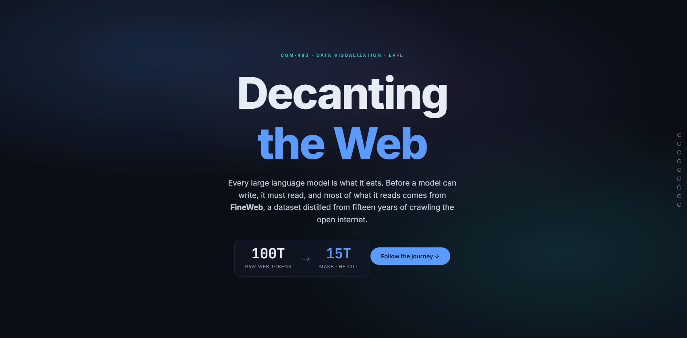

# Decanting the Web — Inside FineWeb 🌐

An interactive, scroll-driven **D3.js** data story about [**FineWeb**](https://huggingface.co/datasets/HuggingFaceFW/fineweb) — the 15-trillion-token English dataset used to pre-train modern large language models. It follows the data from the raw Common Crawl, through the curation funnel, to the shape of what survives.

> **COM-480 Data Visualization — EPFL · Milestone 3**
> Built on the Milestone-1 exploratory analysis ([`FineWeb_EDA.ipynb`](FineWeb_EDA.ipynb)).



| | |
|---|---|
| 🔗 **Live demo** | [com-480-data-visualization.github.io/FineWeb_Alireza](https://com-480-data-visualization.github.io/FineWeb_Alireza/) _(enable GitHub Pages to activate)_ |
| 🎥 **Screencast** | _replace with your video link_ (see [`screencast/`](screencast/)) |
| 📖 **Process book** | [`process-book/process-book.pdf`](process-book/process-book.pdf) |
| 📊 **Dataset** | HuggingFace `HuggingFaceFW/fineweb` · `sample-10BT` |
| 💻 **Repository** | [com-480-data-visualization/FineWeb_Alireza](https://github.com/com-480-data-visualization/FineWeb_Alireza) |
| 👤 **Author** | Alireza Abdollahpoorrostam · SCIPER 380830 |

---

## ✨ What it does

A single-page scrollytelling site. As you scroll, a pinned chart on the right updates to match the narrative on the left. Seven linked, interactive visualizations:

1. **The Curation Funnel** — how 100T raw tokens are filtered down to 15T (hover any stage for what it removes).
2. **Document Length** — token-count histogram with a live **linear ↔ log** toggle, revealing the log-normal shape and heavy tail.
3. **Language Score** — the fastText English-score distribution, the 0.65 filter, and the murky sub-0.95 tail.
4. **The Web Through Time** — documents / tokens / length across 12 years and all 96 Common-Crawl snapshots (metric + granularity toggles).
5. **The Domain Galaxy** — a force-packed bubble field of top domains; **search** any domain, **filter** by category, **re-size** by documents or tokens.
6. **Concentration** — a Lorenz curve with the Gini coefficient and cumulative token coverage (hover to read any share).
7. **The Quality Landscape** — a 2-D heatmap of language score × document length.

Every chart has hover tooltips, smooth transitions, is driven by both scroll *and* manual controls, and is fully responsive.

---

## 🚀 Run it locally

The site is **vanilla HTML + ES modules + D3 v7** (loaded from a CDN). There is **no build step**. Because it uses `fetch()` for the data, you must serve it over HTTP — opening `index.html` from the file system will be blocked by the browser.

```bash
# from the repository root — pick any one:
python -m http.server 8000
#   or
npx serve .
#   or VS Code: right-click index.html → "Open with Live Server"
```

Then open **http://localhost:8000**.

> Requires an internet connection on first load to fetch D3 and the web fonts from their CDNs.

---

## 🌍 Deploy (GitHub Pages)

The repo is static, so hosting is trivial:

1. Push to GitHub.
2. **Settings → Pages → Build and deployment → Source: _Deploy from a branch_**, branch `main`, folder `/ (root)`.
3. Your site goes live at `https://com-480-data-visualization.github.io/FineWeb_Alireza/`.

No secrets, no server, no CI required.

---

## 📁 Project structure

```
.
├── index.html                  # the scrollytelling page (structure + narrative copy)
├── css/
│   └── style.css               # dark editorial theme + scrolly layout
├── js/
│   ├── main.js                 # orchestrator: load data → mount charts → wire scroll
│   ├── config.js               # shared palette / categories / fonts
│   ├── utils.js                # data loading, formatters, tooltip, resize helper
│   ├── scroller.js             # IntersectionObserver scrollytelling controller
│   └── charts/
│       ├── funnel.js           # 1 · curation funnel
│       ├── distribution.js     # 2 · token-count histogram (linear/log)
│       ├── language.js         # 3 · language-score distribution
│       ├── temporal.js         # 4 · volume over time
│       ├── galaxy.js           # 5 · domain galaxy (force bubbles)
│       ├── concentration.js    # 6 · Lorenz curve + token coverage
│       └── quality.js          # 7 · quality heatmap
├── data/
│   └── *.json                  # small pre-computed aggregates (see below)
├── scripts/
│   ├── generate_aggregates.py  # produces data/*.json (faithful to the M1 EDA)
│   └── prepare_data.py         # regenerates data/*.json from the LIVE FineWeb stream
├── process-book/               # process book (HTML → PDF)
├── screencast/                 # 2-minute video script & storyboard
├── FineWeb_EDA.ipynb           # Milestone-1 exploratory analysis
└── requirements.txt
```

Each chart is an isolated ES module exporting a factory `create…(container, data)` that returns `{ update(step), resize() }`. `main.js` mounts them by matching each `<section data-chart="…">` to a factory and forwards scroll events. Adding or reordering a chart is a localized change.

---

## 🔢 The data

The visualization is fed by **aggregated statistics**, not raw text, so the committed `data/*.json` files are tiny (~50 KB total) and the site loads instantly.

There are two ways to produce them:

### A. Shipped aggregates (default)
`scripts/generate_aggregates.py` simulates a 200,000-document sample whose distributions are **faithful to the Milestone-1 EDA** (token-count log-normal skew, language-score concentration with a 0.65 floor, 96 dumps over 2013–2024 with recent years dominating, power-law domain concentration with a moderate Gini, the curation-funnel token counts from the FineWeb paper, the TLD mix, the quality landscape, and chars-per-token ≈ 4–5). It then computes exactly the aggregations the notebook computes.

```bash
python scripts/generate_aggregates.py     # writes data/*.json
```

*What is faithful vs. illustrative:* every **distribution shape and headline statistic** matches the real EDA. The only **illustrative** part is the *specific* document count attached to each named domain in the galaxy — the named sites are real, frequently-crawled domains, and their counts follow the true long-tail shape, but they are representative rather than authoritative per-site measurements. See [`data/meta.json`](data/meta.json).

### B. Regenerate from the real FineWeb stream
`scripts/prepare_data.py` is the Milestone-1 pipeline turned into an export step. It **streams** `sample-10BT` (nothing is fully downloaded), collects a sample, and writes the **same filenames and schema** — so the site behaves identically, now with authoritative per-domain numbers.

```bash
pip install -r requirements.txt
python scripts/prepare_data.py --sample 200000
```

This needs a network connection and a few minutes; memory stays O(1) thanks to streaming.

| File | Drives | Key fields |
|---|---|---|
| `summary.json` | hero / stat slots | totals, medians, year range, Gini inputs |
| `funnel.json` | §1 funnel | per-stage token volume + descriptions |
| `token_hist.json` | §2 length | linear & log histograms, median |
| `lang_hist.json` | §3 language | score histogram, threshold, `frac_ge` |
| `yearly.json`, `dumps.json` | §4 time | per-year & per-snapshot metrics |
| `domains.json` | §5 galaxy | top domains (name, category, tld, docs, tokens) |
| `lorenz.json`, `cumulative_tokens.json` | §6 concentration | Lorenz points + Gini; token-coverage curve |
| `quality_heatmap.json` | §7 quality | language × length count grid |
| `tld.json`, `chars_per_token.json` | extras | TLD mix; lexical density |

---

## 🛠️ Tech & design notes

- **D3 v7** for all rendering; **vanilla ES modules** for structure — no framework, no bundler, no `node_modules`.
- **Scrollytelling** via the native `IntersectionObserver` (a ~40-line controller in `scroller.js`), so there is zero scroll-library dependency.
- **One palette** shared between CSS variables and `js/config.js` keeps the charts visually coherent.
- **Responsive**: charts redraw on container resize; on mobile the layout collapses to a sticky graphic above the narrative.
- **Accessibility**: semantic sections, keyboard-reachable controls, and `prefers`-friendly contrast on a dark canvas.

---

## 📜 Credits & license

- Dataset: **FineWeb** (Penedo et al., *The FineWeb Datasets: Decanting the Web for the Finest Text Data at Scale*, NeurIPS 2024), CC-licensed by Hugging Face.
- Built for EPFL **COM-480 Data Visualization**.
- Author: **Alireza Abdollahpoorrostam** (SCIPER 380830) — individual submission.

Code released under the MIT License (see `LICENSE`).
